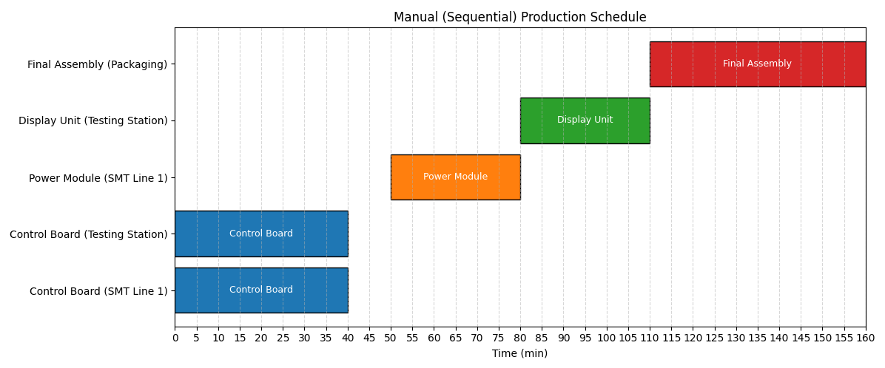
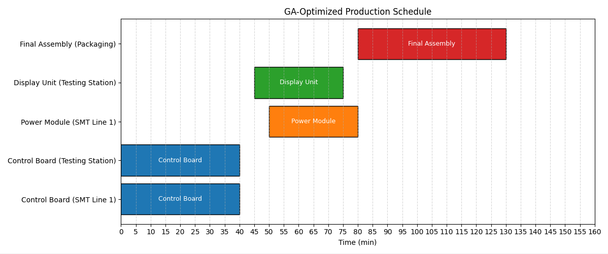

# Factory Scheduling Experiment

**Factory Scheduling Experiment** is a proof-of-concept project for AI-driven production scheduling in electronic equipment factories. It demonstrates how a Genetic Algorithm (GA) can optimize production schedules compared to manual (sequential) planning, using real-world constraints such as machine cooldowns, dependencies, and resource allocation.

---

## Features

- **Smart Task Scheduling:**  
  Uses a Genetic Algorithm to generate efficient production schedules, maximizing machine utilization and minimizing total production time.
- **Manual Baseline Comparison:**  
  Simulates a user-planned, sequential schedule for direct performance comparison.
- **Gantt Chart Visualization:**  
  Visualizes both manual and AI-optimized schedules for easy comparison.
- **Realistic Constraints:**  
  Models machines and product components with real-world attributes (cooldown, prerequisites, etc.).
- **Performance Metrics:**  
  Compares total production time (makespan) for both approaches.

---

## Getting Started

### Prerequisites

- Python 3.7+
- [matplotlib](https://matplotlib.org/)

### Installation

1. **Clone the repository:**
   ```bash
   git clone https://github.com/KikyoBRV/TaskAlign.git
   cd factory_scheduling_experiment
   ```

2. **Install dependencies:**
   ```bash
   pip install -r requirements.txt
   ```

---

## Usage

From the parent directory of `factory_scheduling_experiment`, run:

```bash
python -m factory_scheduling_experiment.main
```

This will:

- Print the total production time for both manual and GA-optimized schedules. 
- Display Gantt charts for both schedules, using the same time scale for easy comparison.

(You have to close the manual Gantt chart first in order for the program to display the GA-optimized Gantt chart.)

---

## Example Output

**Manual (Sequential) Schedule:**



**GA-Optimized Schedule:**



**Performance Comparison:**

```
Manual (sequential) total production time: 160 min
GA-Optimized total production time: 130 min

Performance improvement: 30 min faster using GA optimization.
```

---

## Project Structure

```
factory_scheduling_experiment/
│
├── __init__.py
├── models.py                # Data models for Machine and ProductComponent
├── test_data.py             # Sample data for machines and components
├── ga_scheduler.py          # Genetic Algorithm scheduling logic
├── manual_scheduler.py      # Manual (sequential) scheduling logic
└── main.py                  # Main script: runs both schedulers and plots results
```

---

## How It Works

1. **Data Preparation:**  
   Machines and product components are defined with realistic attributes and dependencies.
2. **Manual Scheduling:**  
   Schedules one component at a time, regardless of machine availability.
3. **GA Scheduling:**  
   Uses a genetic algorithm to find the most efficient schedule, allowing parallelism and maximizing resource use.
4. **Visualization:**  
   Both schedules are visualized as Gantt charts for direct comparison.
5. **Performance Metrics:**  
   Total production time is calculated and compared.

---

## How GA Scheduling Works

The Genetic Algorithm (GA) in this project is designed to find efficient production schedules by simulating the process of natural selection. Here’s how it works in this theory test:

1. **Population Initialization:**  
   The algorithm starts by generating a population of random, valid schedules. Each schedule is an ordering of all production tasks, ensuring that prerequisites are respected.

2. **Schedule Decoding:**  
   For each schedule, the algorithm simulates the production process:
   - Tasks are assigned to machines as soon as their prerequisites and required machines are available.
   - Machine cooldowns and other constraints are enforced.
   - The start and end times for each task are recorded.

3. **Fitness Evaluation:**  
   Each schedule is scored based on its **total production time** (makespan). Schedules that finish all tasks sooner receive higher fitness scores.

4. **Selection:**  
   The best-performing schedules are selected to form the next generation, using a tournament selection method.

5. **Crossover:**  
   Pairs of schedules are combined to create new schedules, mixing their task orders while maintaining valid dependencies.

6. **Mutation:**  
   Some schedules are randomly altered (e.g., swapping two tasks) to introduce diversity, as long as prerequisites are not violated.

7. **Repair:**  
   After crossover and mutation, a repair step ensures that all task dependencies are still respected.

8. **Iteration:**  
   Steps 2–7 are repeated for a set number of generations. Over time, the population evolves toward more efficient schedules.

9. **Best Schedule Selection:**  
   After all generations, the schedule with the shortest total production time is selected as the optimal solution.

**Result:**  
The GA finds a schedule that overlaps tasks where possible, maximizes machine utilization, and minimizes total production time often outperforming manual, sequential planning.
